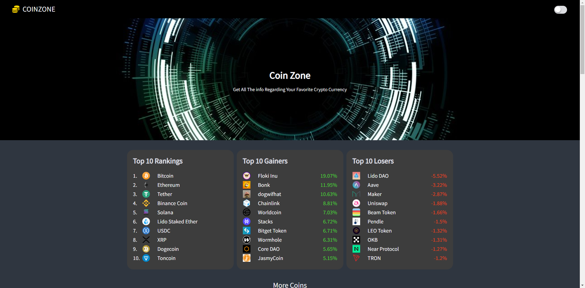
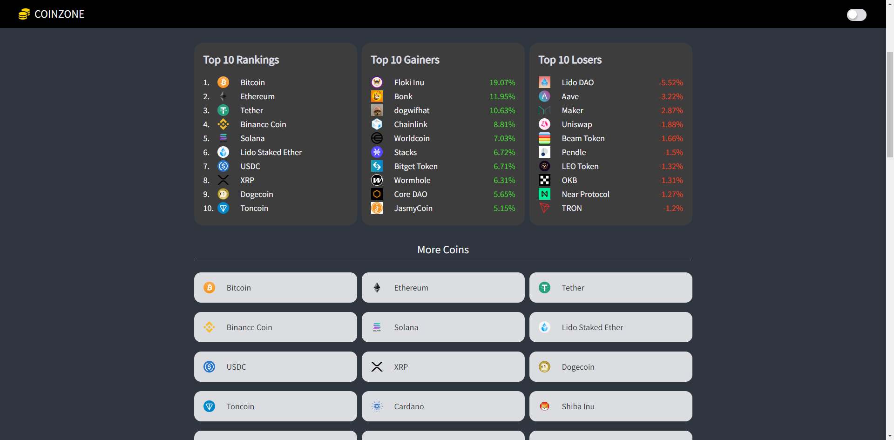
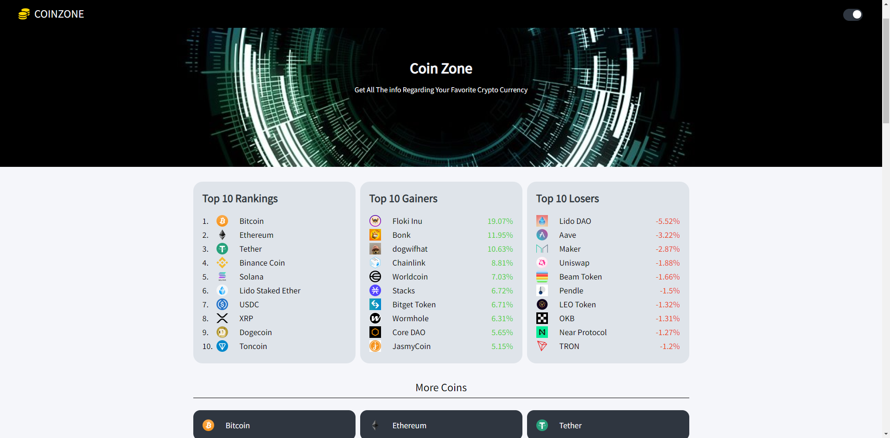
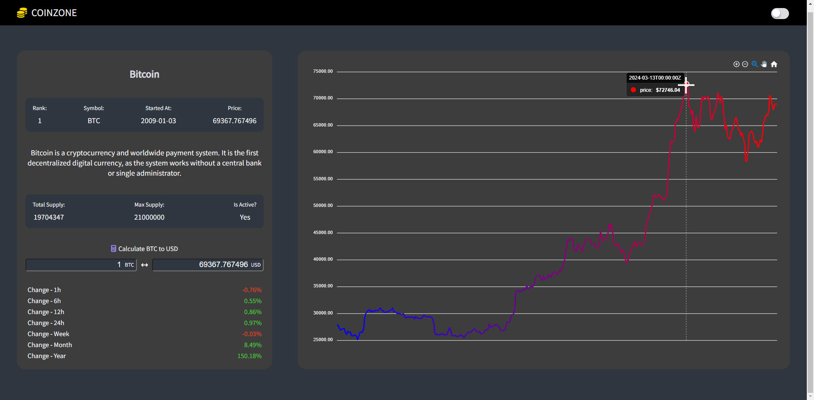

# CoinZone

This app provides cryptocurrency data with the price detail and its trend in visual graphs.

## Features

- View list of coins
- View top 10 gainer / loser
- View coin detail in graph - price change in last 1 year
- Simple Coin to USD, USD to Coin calculator
- Light/dark mode toggle
- Responsive view

## Tech Stack

## Lessons Learned

- React Query helps fetch, cache, and poll data so that the browser doesn't need to reload if data doesn't change

- Recoil helps manage states in a separate memory and enables access-from-anywhere concept so it minimizes number of data passing between components. In this project, it helped change the theme without complexity where each component only needs to look at the Recoil Atom(theme state) and apply proper colors.

- ApexChart is a good tool to visualize data with a simple template where user can insert data to, and also it has a built-in animated effect on graph, and is flexible to customizing based on user's needs.

## Screenshots

Main Page #1 -
Header with button to toggle light theme and dark theme, default is dark theme.
Displays:

- Top 10 coins based on price
- Top 10 gainers based on growth
- Top 10 losers based on growth

Main Page #2 -
Displays list of more coins, user can click on each card to view details

Main Page #3 -
Light mode

Detail Page -
Displays coin information with graph of 1 year data in 1 day interval
Built with simple calculator - coin to USD & USD to coin
